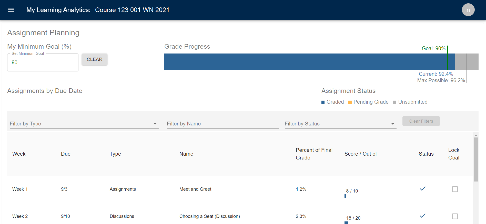
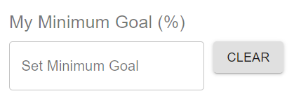
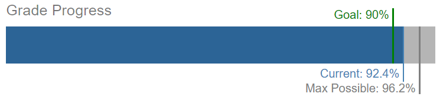
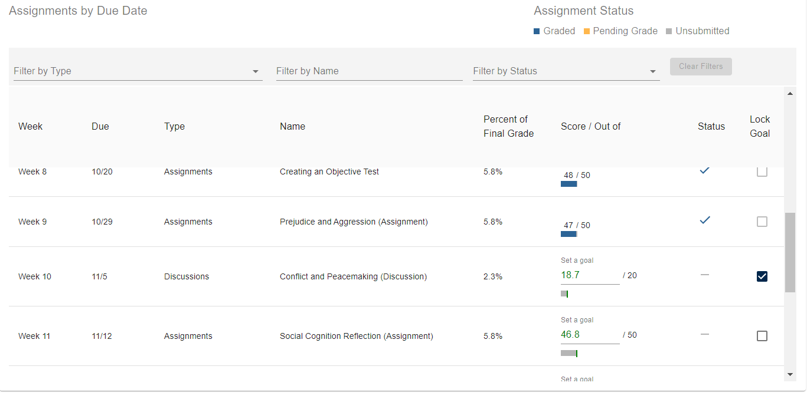

# Assignment Planning
## View your progress & upcoming assignments & set goals

The Assignment Planning page shows two different assignment visualizations:

**Minimum Goal and Grade Progress**: At the top of the page you can set a minimum course goal and view a bar showing your current grade, maximum possible grade, and minimum goal grade.

**Assignments by Due Date**: View upcoming and past assignments by week. For each assignment, you can see when it's due, how much it figures into your final grade, and your grade (for graded assignments).

**NOTE**: Only assignments that show up in your Canvas course appear in the visualizations.

## Minimum Goal
**Using My Minimum Goal (%)**

* Set a minimum course goal as a percentage by typing in a number or using the up/down arrows in the text box. When you do this, you’ll see your goal show up on the Grade Progress bar. MyLA will also calculate the grades you need to get on all ungraded assignments to meet that goal.
* Use the Clear button to remove the course goal and all assignment goals.

## Grade Progress
**Using the Grade Progress Bar**

* Current: The blue line and blue bar show your current grade in the course based on Canvas data.
* Max Possible: The dark gray line shows the maximum possible grade you can earn in the course based on your assignments so far.
* Goal: The green line shows the minimum course goal, if you have set that goal.

**NOTE:** The grades on the progress bar are based on data from your Canvas course. Always consult the syllabus and your instructor for information about how grading works in the course.

## Assignments Due by Date
**Using the Assignments List**

* Use the drop-down option to decide which assignments you want to see in the list based on their impact on your grade. You can choose your default setting. Select a weight from the drop-down, then save it by checking "Remember my setting." This filter will be automatically applied each time you return to the page. You can change your default at any time.
* Scroll up and down the list to see past and future assignments.
* **Filter by Type:** Use this option to select which assignments to include on the list by selecting the types of assignments you want to see. These are the types, or assignment groups, that have been set up in the course.
* **Filter by Name:** Use this option to filter the list of assignments based on the name of the assignment.
* **Filter by Status:** Use this option to filter the list of assignments based on whether the assignments have been graded, are pending grades, or haven’t been submitted yet.
* **Clear Filters:** Click this button to clear any filters that you’ve added to the assignment list.
* **Graded/Pending Grade/Unsubmitted:** Graded assignments display in blue. Assignments that have been submitted but have not been graded display as “pending grade” in orange. Assignments that have not yet been submitted display in gray.