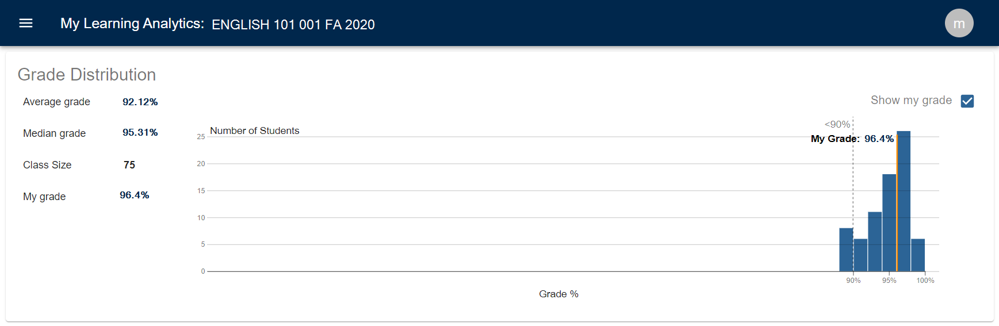

# Grade Distribution

## View the class grade distribution

This visualization shows the distribution of grades in the class along with the number of students in the class and the average and median grades.

You can also select to view your grade in the distribution by clicking on the "Show my grade" checkbox.

**NOTE:** Grades reflect current scores in Canvas. Your course may have additional assignments or rules that impact your grade. Always refer to your syllabus or other grade information provided by your instructor.